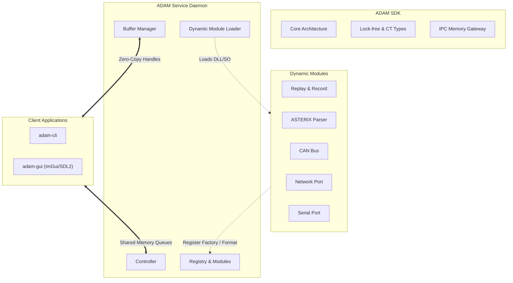
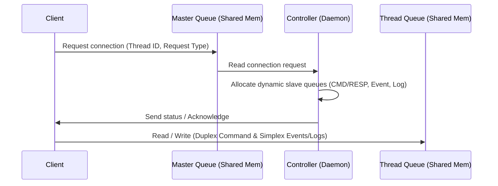
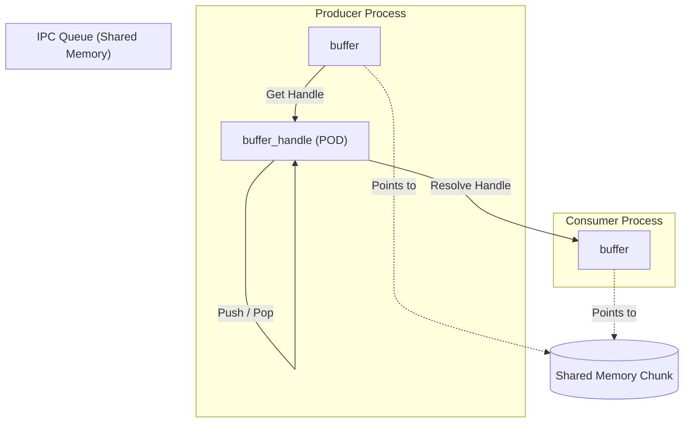

<div align="center">
  
  
# 🌌 ADAM (Advanced Data Acquisition & Modulation)
</div>

ADAM is a modular, high-performance, real-time data routing and processing engine written in modern C++23. It is designed to run as a system service (daemon) and interface with multiple client applications using a custom, ultra-low-latency, zero-copy Inter-Process Communication (IPC) framework based on shared memory.

The system is highly extensible, allowing developers to dynamically load modules that introduce new data formats, port interfaces (e.g., Serial, CAN, Network), and stream processors (filters and converters).

---

## 🏗️ System Architecture

ADAM splits functionality into a Core Service, a lightweight SDK for external applications and modules, and Client Applications for administration and telemetry.



---

## ⚡ Core Concepts & Architectural Components

### 1. Zero-Copy IPC Shared-Memory Queues
At the heart of ADAM's IPC architecture is a **Master-Slave Queue System** designed to eliminate network stack latency and context-switching overhead.



* **Master Queue (`adam::controller_master_queue`)**: A well-known circular queue in shared memory. When client applications (like `adam-cli` or `adam-gui`) boot, they register their thread ID to this queue.
* **Slave Queues**: Upon reading a registration request, the controller creates thread-unique shared memory queues containing the client's thread ID in the name (e.g., `adam::controller_queue_command_<tid>`).
  * `queue_command`: A duplex (bidirectional) queue for executing commands and returning responses.
  * `queue_log` & `queue_log_sink`: Simplex queues that multiplex and distribute logger messages to all connected sinks in real-time.
  * `queue_event`: A simplex queue for broadcasting state changes and system notifications.
* **Circular Queue Design**: Implemented in `queue_shared.hpp` as a lock-free Single-Producer Single-Consumer (SPSC) circular buffer using raw placement-new memory layouts and memory barriers (`std::memory_order_relaxed`, `std::memory_order_acquire`, `std::memory_order_release`) for index synchronization.
* **OS Signaling (`memory_signaled`)**: To prevent spinning threads from consuming 100% CPU, ADAM wraps platform-specific synchronization primitives (Win32 Named Events on Windows, POSIX Named Semaphores on Linux) to block and wake reader threads immediately when data is pushed.

---

### 2. High-Performance Shared Memory Allocation
To achieve zero-copy data routing across process boundaries, ADAM includes a custom memory management subsystem.



* **Zero-Copy Buffer Handles (`buffer_handle`)**: Instead of passing all metadata over IPC, ADAM passes an ultra-compact 16-byte POD handle containing a shared memory segment index (`memory_index`), byte offset (`offset`), payload capacity (`capacity`), and the creator's thread ID (`thread_id`).
* **Shared Memory Buffer Header (`buffer::header`)**: All buffer metadata (including capacity, size, start position, data format hash, timestamp, and a `buffer_handle` referencing another buffer for chaining) is stored in a structured header directly at the start of the buffer's shared memory segment.
* **Buffer Chaining (Zero-Copy Linking)**: The `buffer` class supports linking or chaining buffer objects together using `set_referenced_buffer()` and `get_referenced_buffer()`. This embeds the target buffer's handle directly inside the structured shared memory header, allowing complex, multi-part buffers to be transmitted across process boundaries without payload copying.
* **Cross-Process Reference Counting**: Reference counting atomics are part of the `buffer::header` allocated within the shared memory segment. This enables correct, thread-safe object lifecycles across process boundaries. Once all processes call `release()` and the reference count hits zero, the buffer returns to the manager.
* **Surrogate Buffer Resolution**: When a client process calls `resolve_handle()`, the `buffer_manager` instantiates a lightweight local surrogate `buffer` object mapping to the shared memory header/payload and marks it as resolved. Releasing a surrogate buffer recycles the local object back to a dedicated free list rather than returning the shared segment memory back to global pools prematurely.
* **Capacity Classes & Segment Pooling**: The `buffer_manager` splits memory into 30 power-of-two size classes (up to 4GB segments). Large contiguous shared memory files (chunks of 16MB by default) are allocated and split into pool blocks of these size classes.
* **Thread-Local Caching**: Highly inspired by `tcmalloc` and `jemalloc`, threads running data pipelines maintain a local pool of reusable buffers (`buffer_thread_cache`) to avoid global lock contention during high-speed routing. If the local cache runs empty, it requests a batch (32 buffers) from the global pool using a lightweight `std::atomic_flag` spinlock.

---

### 3. Dataflow Execution Pipeline
ADAM provides a structured pipeline for routing, filtering, and converting data streams.

* **Configuration Items (`configuration_item`)**: The base class for all configurable pipeline elements. It hosts a `configuration_parameter_list` supporting types like Boolean, Integer, Double, String, Reference, and nested Parameter Lists. It supports runtime deep-cloning of static default parameters, making instantiation clean, and serializes directly to binary configurations.
* **Ports (`port`, `port_input`, `port_output`, `port_in_out`)**: Abstract interfaces representing endpoints for data flow.
  * **Threaded Ports**: Background worker threads run a continuous loop pulling data from physical hardware or virtual resources via `read()` and dispatching it using `handle_data()`.
  * **Statistics Monitoring**: Every port maintains a statistics block in shared memory recording real-time `total_bytes_handled`, `total_buffers_handled`, and `total_discarded` metrics.
* **Connections (`connection`)**: High-level routing topologies that dynamically chain $N$ inputs to $M$ outputs. A connection does more than just pass data; it actively manages the entire data pipeline lifecycle, starting and stopping physical ports automatically as the connection is toggled.
* **Data Formats & Pipeline Verification**: All data streams enforce strict format identifiers. The `connection` validates the pipeline before activation using `check_valid_chain()`. It traverses the inputs, through the list of processors, ensuring format compatibility across the entire chain (e.g., input format matches processor input, processor output matches next processor input, and final output matches the output ports).
* **Processors (`data_processor`)**: Intermediary plugins placed inside a connection's route to process passing data.
  * **Filters (`filter`)**: Read data and return boolean results to either drop or accept buffers without modifying the underlying format.
  * **Converters (`converter`)**: Transform data from one schema layout to another (e.g., parsing raw CAN bytes into structured physical variables).
* **Data Inspectors (`data_inspector`)**: Live diagnostic tap points that can be attached to any individual port, or directly to a connection's input/output streams. They safely copy passing data buffers and stream them to client telemetry applications without blocking or altering the main high-speed pipeline.

---

### 4. Modern C++ Optimizations

* **Rapidhash Algorithm**: ADAM uses the state-of-the-art **Rapidhash** hashing algorithm (a fast, collision-resistant derivative of `wyhash`) for speed-critical mapping lookups.
* **Compile-Time Hashed Strings (`string_hashed_ct`)**: Features a custom user-defined literal operator `_ct` (e.g., `"is_active"_ct`). The compiler resolves this string into a `uint64_t` hash at compile-time. This allows ADAM to perform `std::unordered_map` lookups with zero runtime hashing overhead and utilize switch-case statements on hashed strings:
  ```cpp
  switch(parameter.get_name().get_hash()) {
      case "is_active"_ct: // Constant evaluated at compile time
          // Handle activation parameter
          break;
  }
  ```
* **Double Buffering Synchronization**: To allow lock-free reads and iterations during hot-path data processing, ADAM implements two double-buffering patterns:
  * **`vector_double_buffer`**: Used for list structures (e.g., connections, ports, and inspectors). Readers iterate through a stable active vector (`m_active`) without locks. When a write occurs, the writer updates a pending vector (`m_pending`) under a mutex and sets a dirty flag. The next read operation performs a cheap atomic swap to update the active cache.
  * **`map_double_buffer`**: A generic thread-safe double-buffered map. Readers obtain lock-free read access to a stable active `std::unordered_map` (`get_active()`). Write modifications completely overwrite a pending map under a lock and set a dirty flag; the next read operation automatically swaps/updates the active map with the pending changes.

---

## 🧩 Modules (Plugins)

ADAM modules can be integrated in two ways:
1. **Dynamic (External):** Compiled as shared libraries (`.dll` on Windows, `.so` on Linux) and loaded at runtime. These must export the core entry point:
   ```cpp
   extern "C" adam::module* get_adam_module();
   ```
2. **Static (Internal):** Built directly into the daemon for core functionality that must always be present (e.g., the `essential` module).

The repository features the following built-in modules:

| Module | Description | Port Types | Custom Formats / Processors |
| :--- | :--- | :--- | :--- |
| **`essential`** | Core internal module for basic functionality (Static). | `internal` | `transparent` format, `frame_aligner` filter. |
| **`recrep`** | Handles recording and replaying streams. | `replay` (Ingress), `recording` (Egress) | Data-format independent stream serializations. |
| **`asterix`** | Aviation radar formatting. | N/A (Format module) | Eurocontrol ASTERIX parsing/converters. |
| **`can`** | CAN bus serial handling. | `can` port | Custom CAN frame mapping converters. |
| **`network`** | TCP/UDP socket management. | Socket Ingress / Egress | Transparent stream routing. |
| **`serial`** | RS-232 / RS-485 serial communications. | `serial` port | Parity, baud rate, and flow control parameter mapping. |

---

## 💻 Applications

### ⚙️ `adam` (Daemon)
The core service. It initializes the shared memory regions, cleans up orphaned "zombie" segments from previous crashes (via `cleanup_zombie_shared_memory()`), boots the master queue loop, loads dynamically linked modules from directory configurations, and hosts the command dispatcher.

### 🐚 `adam-cli`
A feature-rich command-line administrative interface.
* **Non-blocking Logger Overlay**: Intercepts stdout to display incoming logs from the daemon without corrupting the active user input prompt line.
* **Interactive Prompt**: Features custom input parsing, command history (up/down arrow keys), cursor placement navigation (left/right arrow keys), and tab-autocompletion for commands.
* **Dual-Language Configuration**: Supports runtime translation switching (English/German) for all diagnostic screens, commands, and warning output logs.

### 📊 `adam-gui`
A hardware-accelerated desktop telemetry dashboard built using **Dear ImGui** backed by **SDL2** and **OpenGL 3**.
* **Visual Connections Manager**: Allows administrators to view, create, configure, start, and stop connections and ports using interactive ImGui windows.
* **Data Inspector View**: Features a powerful real-time interface to inspect live telemetry. Allows administrators to tap into connection inputs/outputs or raw ports, showing a dual hex-dump and ASCII live preview of intercepted messages.
* **Theme Customization**: Offers standard light and dark mode toggles with customizable font scales.
* **Performance Telemetry Overlay**: Renders dynamic FPS, CPU, and RAM overlays, which can be configured to snap to any corner of the screen.

---

## 🛠️ Build & Installation

### Requirements
* C++23 Compiler (GCC 13+, Clang 16+, MSVC 19.38+)
* CMake 3.25+
* SDL2 (Required for `adam-gui`)
* OpenGL 3 (Required for `adam-gui`)
* Dear ImGui (Provide path via `$ENV{IMGUI_ROOT}`)

### Build Procedure
Ensure all dependencies are met, then configure the build using CMake Presets or traditional builds:

```bash
# Configure the build system
cmake -B out -DCMAKE_BUILD_TYPE=Release

# Build the applications and modules
cmake --build out --config Release
```

The resulting binaries will be populated inside `out/bin`. Run `adam` first to spawn the main IPC server, then connect using `adam-cli` or `adam-gui`.

---

## 🔮 Future & Planned Features

This section is for noting down ideas and planned improvements for future implementation:

* **[ ] Data Inspector - Comparison** - Show exact diffs of two or more messages side by side and highlight all differences.

