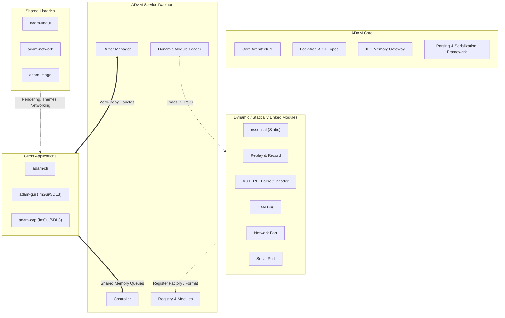
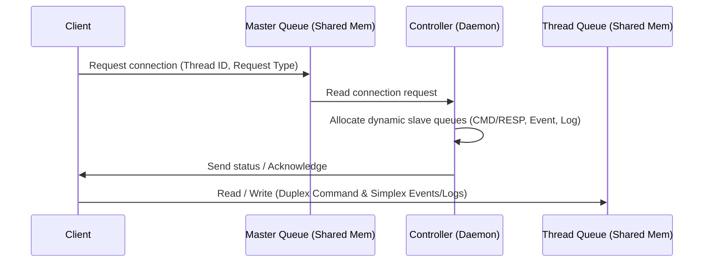
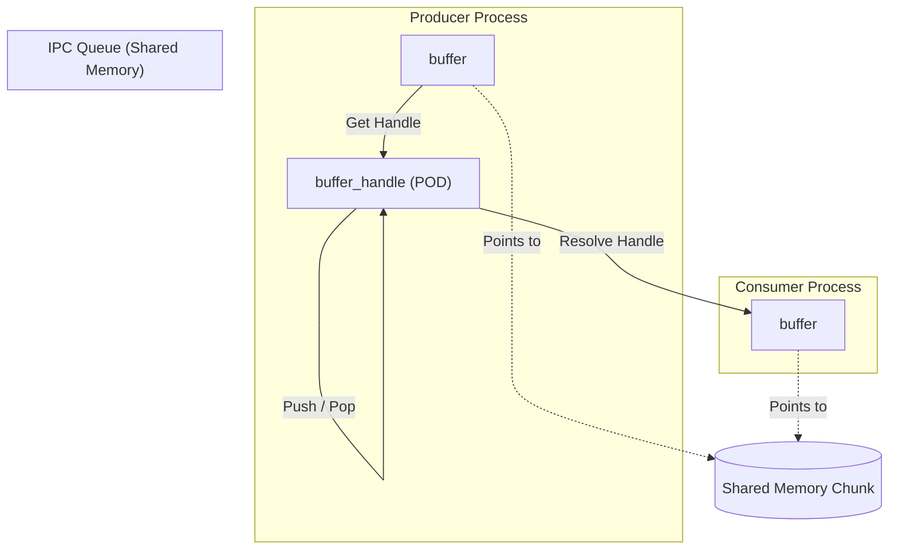
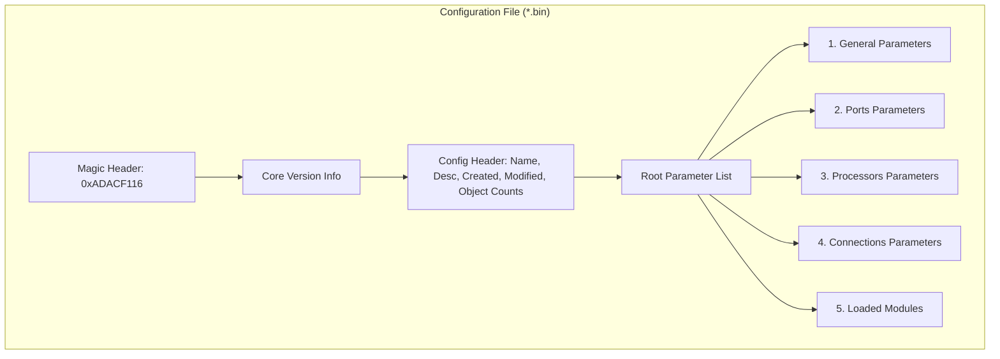

<div align="center">
  
  
# 🌌 ADAM (Advanced Data Acquisition & Modulation)
</div>

ADAM is a modular, high-performance, real-time data routing and processing engine written in modern C++23. It is designed to run as a system service (daemon) and interface with multiple client applications using a custom, ultra-low-latency, zero-copy Inter-Process Communication (IPC) framework based on shared memory.

The system is highly extensible, allowing developers to dynamically load modules that introduce new data formats, port interfaces (e.g., Serial, CAN, Network), and stream processors (filters and converters).

---

## 🏗️ System Architecture

ADAM splits functionality into a Core Library (`adam-core`), Shared Libraries for common functionality, Modules, and Client Applications for administration, telemetry, and situational awareness.


```mermaid
graph TD
    subgraph CoreLib["ADAM Core"]
        direction TB
        Core[Core Architecture]
        Types[Lock-free & CT Types]
        Mem[IPC Memory Gateway]
        ParseFrame[Parsing & Serialization Framework]
    end

    subgraph Libraries["Shared Libraries"]
        direction LR
        imgui_tools["adam-imgui"]
        network_tools["adam-network"]
        image_tools["adam-image"]
    end

    subgraph CoreService["ADAM Service Daemon"]
        direction TB
        Ctrl[Controller]
        Reg[Registry & Modules]
        BufMgr[Buffer Manager]
        Loader[Dynamic Module Loader]
    end

    subgraph Plugins["Dynamic / Statically Linked Modules"]
        direction LR
        essential["essential (Static)"]
        recrep["Replay & Record"]
        asterix["ASTERIX Parser/Encoder"]
        can["CAN Bus"]
        network["Network Port"]
        serial["Serial Port"]
    end

    subgraph Clients["Client Applications"]
        direction LR
        cli[adam-cli]
        gui["adam-gui (ImGui/SDL3)"]
        cop["adam-cop (ImGui/SDL3)"]
    end

    %% Communications
    Clients <==>|Shared Memory Queues| Ctrl
    Loader -.->|Loads DLL/SO| Plugins
    Plugins -.->|Register Factory / Format| Reg
    BufMgr <==>|Zero-Copy Handles| Clients
    Libraries -.->|Rendering, Themes, Networking| Clients
```

---

## ⚡ Core Concepts & Architectural Components

### 1. Zero-Copy IPC Shared-Memory Queues
At the heart of ADAM's IPC architecture is a **Master-Slave Queue System** designed to eliminate network stack latency and context-switching overhead.


```mermaid
sequenceDiagram
    participant Client
    participant MasterQueue as Master Queue (Shared Mem)
    participant Controller as Controller (Daemon)
    participant SlaveQueue as Thread Queue (Shared Mem)

    Client->>MasterQueue: Request connection (Thread ID, Request Type)
    MasterQueue->>Controller: Read connection request
    Controller->>Controller: Allocate dynamic slave queues (CMD/RESP, Event, Log)
    Controller->>Client: Send status / Acknowledge
    Client->>SlaveQueue: Read / Write (Duplex Command & Simplex Events/Logs)
```

* **Master Queue (`adam::controller_master_queue`)**: A well-known circular queue in shared memory. When client applications (like `adam-cli` or `adam-gui`) boot, they register their thread ID to this queue.
* **Slave Queues**: Upon reading a registration request, the controller creates thread-unique shared memory queues containing the client's thread ID in the name (e.g., `adam::controller_queue_command_<tid>`).
  * `queue_command`: A duplex (bidirectional) queue for executing commands and returning responses.
  * `queue_log` & `queue_log_sink`: Simplex queues that multiplex and distribute logger messages to all connected sinks in real-time.
  * `queue_event`: A simplex queue for broadcasting state changes and system notifications.
* **Circular Queue Design**: Implemented in `queue_shared.hpp` as a lock-free Single-Producer Single-Consumer (SPSC) circular buffer using raw placement-new memory layouts and memory barriers (`std::memory_order_relaxed`, `std::memory_order_acquire`, `std::memory_order_release`) for index synchronization.
* **OS Signaling (`memory_signaled`)**: To prevent spinning threads from consuming 100% CPU, ADAM wraps platform-specific synchronization primitives (Win32 Named Events on Windows, POSIX Named Semaphores on Linux) to block and wake reader threads immediately when data is pushed.

---

### 2. High-Performance Shared Memory Allocation
To achieve zero-copy data routing across process boundaries, ADAM includes a custom memory management subsystem.


```mermaid
graph TD
    subgraph ProducerProcess["Producer Process"]
        BufA[buffer] -->|Get Handle| H["buffer_handle (POD)"]
    end
    subgraph IPCQueue["IPC Queue (Shared Memory)"]
        H -->|Push / Pop| H
    end
    subgraph ConsumerProcess["Consumer Process"]
        H -->|Resolve Handle| BufB[buffer]
    end
    SharedMem[("Shared Memory Chunk")]
    BufA -.->|Points to| SharedMem
    BufB -.->|Points to| SharedMem
```

* **Zero-Copy Buffer Handles (`buffer_handle`)**: Instead of passing all metadata over IPC, ADAM passes an ultra-compact 16-byte POD handle containing a shared memory segment index (`memory_index`), byte offset (`offset`), payload capacity (`capacity`), and the creator's thread ID (`thread_id`).
* **Shared Memory Buffer Header (`buffer::header`)**: All buffer metadata (including capacity, size, start position, data format hash, timestamp, and a `buffer_handle` referencing another buffer for chaining) is stored in a structured header directly at the start of the buffer's shared memory segment.
* **Buffer Chaining (Zero-Copy Linking)**: The `buffer` class supports linking or chaining buffer objects together using `set_referenced_buffer()` and `get_referenced_buffer()`. This embeds the target buffer's handle directly inside the structured shared memory header, allowing complex, multi-part buffers to be transmitted across process boundaries without payload copying.
* **Cross-Process Reference Counting**: Reference counting atomics are part of the `buffer::header` allocated within the shared memory segment. This enables correct, thread-safe object lifecycles across process boundaries. Once all processes call `release()` and the reference count hits zero, the buffer returns to the manager.
* **Surrogate Buffer Resolution**: When a client process calls `resolve_handle()`, the `buffer_manager` instantiates a lightweight local surrogate `buffer` object mapping to the shared memory header/payload and marks it as resolved. Releasing a surrogate buffer recycles the local object back to a dedicated free list rather than returning the shared segment memory back to global pools prematurely.
* **Capacity Classes & Segment Pooling**: The `buffer_manager` splits memory into 30 power-of-two size classes (up to 4GB segments). Large contiguous shared memory files (chunks of 16MB by default) are allocated and split into pool blocks of these size classes.
* **Thread-Local Caching**: Highly inspired by `tcmalloc` and `jemalloc`, threads running data pipelines maintain a local pool of reusable buffers (`buffer_thread_cache`) to avoid global lock contention during high-speed routing. If the local cache runs empty, it requests a batch (32 buffers) from the global pool using a lightweight `std::atomic_flag` spinlock.

---

### 3. Dataflow Execution Pipeline
ADAM provides a structured pipeline for routing, filtering, and converting data streams.

* **Configuration Items (`configuration_item`)**: The base class for all configurable pipeline elements. It hosts a `configuration_parameter_list` supporting types like Boolean, Integer, Double, String, Reference, and nested Parameter Lists. It supports runtime deep-cloning of static default parameters, making instantiation clean, and serializes directly to binary configurations.
* **Ports (`port`, `port_input`, `port_output`, `port_in_out`)**: Abstract interfaces representing endpoints for data flow.
  * **Threaded Ports**: Background worker threads run a continuous loop pulling data from physical hardware or virtual resources via `read()` and dispatching it using `handle_data()`.
  * **Statistics Monitoring**: Every port maintains a statistics block in shared memory recording real-time `total_bytes_handled`, `total_buffers_handled`, and `total_discarded` metrics.
* **Connections (`connection`)**: High-level routing topologies that dynamically chain $N$ inputs to $M$ outputs. A connection does more than just pass data; it actively manages the entire data pipeline lifecycle, starting and stopping physical ports automatically as the connection is toggled.
* **Data Formats & Pipeline Verification**: All data streams enforce strict format identifiers. The `connection` validates the pipeline before activation using `check_valid_chain()`. It traverses the inputs, through the list of processors, ensuring format compatibility across the entire chain (e.g., input format matches processor input, processor output matches next processor input, and final output matches the output ports).
* **Processors (`data_processor`)**: Intermediary plugins placed inside a connection's route to process passing data.
  * **Filters (`filter`)**: Read data and return boolean results to either drop or accept buffers without modifying the underlying format.
  * **Converters (`converter`)**: Transform data from one schema layout to another (e.g., parsing raw CAN bytes into structured physical variables).
* **Data Inspectors (`data_inspector`)**: Live diagnostic tap points that can be attached to any individual port, or directly to a connection's input/output streams. They safely copy passing data buffers and stream them to client telemetry applications without blocking or altering the main high-speed pipeline.

---

### 4. Zero-Copy Data Parsing & Serialization Framework
To support complex structural formats (like Eurocontrol ASTERIX or CAN payload signals) without sacrificing throughput, ADAM features a zero-copy data parsing and serialization framework.

```
Original Raw Data Buffer (Shared Memory Payload)
 ----------------------------------------------------
| ASTERIX Frame Bytes (Blocks, Records, FSPEC, Data) |
 ----------------------------------------------------
                          ^
                          | (O(1) raw offsets / lengths)
                          |
Parsed Metadata Overlay Buffer (Internal Data Buffer)
 ----------------------------------------------------
| [Frame Header]                                     |
|   |-- [Block 1 Header]                             |
|         |-- [Record 1 Header]                      |
|               |-- [Item FRN 1] {Offset, Len, Pop}  |
|               |-- [Item FRN 2] {Offset, Len, Pop}  |
|               |-- [Item FRN 3] {Offset, Len, Pop}  |
|                    |-- [Child FRN 1]               |
 ----------------------------------------------------
```

* **Data Formats (`data_format`)**: Associates format types with a specific `parser` and `encoder`.
* **Zero-Copy Parser Interface (`parser`)**:
  * Implementations override `bool parse(buffer* buf, buffer*& internal_data)`.
  * Rather than copying raw payload values into heavy C++ object graphs (which fragments memory and invalidates cache lines), the parser parses the stream and constructs a **Metadata Overlay** in a separate, lightweight `internal_data` buffer.
  * **Cross-Process Shared Buffer Hosting**: Since the `internal_data` buffer is requested from the shared `buffer_manager` and links back to the original raw buffer via `set_referenced_buffer()`, **both buffers reside completely in shared memory**. External consumer applications (such as client processes or downstream pipeline steps) can resolve and read both the metadata index and raw payload blocks across process boundaries with **zero data copying** and **zero additional parsing**.
* **Metadata Overlay Architecture**:
  * The parsed output is structured as a contiguous hierarchy of POD headers and descriptors (e.g., `frame`, `block`, `record`, and `item`).
  * Each `item` represents a field defined by the format's User Application Profile (UAP). It contains the Field Reference Number (FRN), whether it is `populated` or `modified`, and its exact `raw_offset` and `raw_length` referencing the original raw buffer.
  * This allows applications to perform $O(1)$ random-access lookups on fields without reparsing raw bytes.
  * Deeply nested fields (compound or explicit fields) store a relative `child_offset` and a `child_count`, pointing to an array of children `item` structs placed consecutively in the same buffer, maintaining high cache locality.
* **Zero-Copy Encoder Interface (`encoder`)**:
  * Implementations override `bool encode(buffer*& buf, buffer* internal_data)`.
  * The encoder re-serializes the structured metadata overlay back to raw format bytes.
  * **Delta and Fast-Path Serialization**:
    * If no modification flag (`modified`) is set in the metadata overlay, the encoder returns the original raw buffer directly with an incremented reference count (zero-copy bypass).
    * If components (blocks, records) are unmodified, the encoder performs raw block transfers (`memcpy`/`fill_data`) from the original buffer. Only modified items are fully serialized and updated.

---

### 5. Modern C++ Optimizations

* **Rapidhash Algorithm**: ADAM uses the state-of-the-art **Rapidhash** hashing algorithm (a fast, collision-resistant derivative of `wyhash`) for speed-critical mapping lookups.
* **Compile-Time Hashed Strings (`string_hashed_ct`)**: Features a custom user-defined literal operator `_ct` (e.g., `"is_active"_ct`). The compiler resolves this string into a `uint64_t` hash at compile-time. This allows ADAM to perform `std::unordered_map` lookups with zero runtime hashing overhead and utilize switch-case statements on hashed strings:
  ```cpp
  switch(parameter.get_name().get_hash()) {
      case "is_active"_ct: // Constant evaluated at compile time
          // Handle activation parameter
          break;
  }
  ```
* **Double Buffering Synchronization**: To allow lock-free reads and iterations during hot-path data processing, ADAM implements two double-buffering patterns:
  * **`vector_double_buffer`**: Used for list structures (e.g., connections, ports, and inspectors). Readers iterate through a stable active vector (`m_active`) without locks. When a write occurs, the writer updates a pending vector (`m_pending`) under a mutex and sets a dirty flag. The next read operation performs a cheap atomic swap to update the active cache.
  * **`map_double_buffer`**: A generic thread-safe double-buffered map. Readers obtain lock-free read access to a stable active `std::unordered_map` (`get_active()`). Write modifications completely overwrite a pending map under a lock and set a dirty flag; the next read operation automatically swaps/updates the active map with the pending changes.
* **Type-Safe Bitwise Enums**: Utilizing `enum-bit-operations.hpp`, ADAM equips custom enum classes (e.g., `item_flag`, `record_flag`, `block_flag`, `frame_flag`) with type-safe bitwise operators, eliminating cast clutter.

---

### 6. Registry Configuration Subsystem
ADAM implements a robust and fast binary configuration serialization format to save and restore the complete system topology including general options, loaded modules, ports, processors, and routing connections.


```mermaid
graph TD
    subgraph Serialization["Configuration File (*.bin)"]
        Magic[Magic Header: 0xADACF116] --> CoreVer[Core Version Info]
        CoreVer --> CfgHeader[Config Header: Name, Desc, Created, Modified, Object Counts]
        CfgHeader --> RootParam[Root Parameter List]
        RootParam --> GenParams[1. General Parameters]
        RootParam --> PortParams[2. Ports Parameters]
        RootParam --> ProcParams[3. Processors Parameters]
        RootParam --> ConnParams[4. Connections Parameters]
        RootParam --> ModParams[5. Loaded Modules]
    end
```

* **Binary Serialization Header**: Every configuration file starts with a standardized header block containing:
  * **Magic Identifier**: A 4-byte magic signature (`0xADACF116`).
  * **Core Version**: A semantic version representation to ensure backward and forward compatibility.
  * **Configuration Metadata**: High-level details including a friendly `name`, `description`, creation/modification timestamps, and total object counts (ports, processors, connections) to allow quick parsing during configuration scanning.
* **Registry Configuration Manager (`registry_configuration_manager`)**: Manages the dynamic lookup of configuration paths and files. It implements:
  * **Configuration Directory Scanning**: Scans all registered config path directories, reads binary headers, and returns structured configuration summaries without loading the entire configuration tree.
  * **Runtime Importing/Exporting**: Saves the current active configuration to, or imports a saved configuration from, directory storage.
* **Graceful Missing Dependency Recovery (Unavailability Caching)**: When a configuration references modules, ports, or processors that are currently missing or cannot be loaded (e.g., when a module DLL has not been deployed to the module directory):
  * Instead of failing the import, the `registry` intercepts these missing dependencies and moves them into dedicated **unavailable registry maps** (`m_unavailable_ports`, `m_unavailable_processors`, `m_unavailable_connections`).
  * These records cache all parameter options and connection references.
  * If the missing module is later successfully scanned and loaded, the registry automatically triggers a retry, instantiates the missing elements, recovers their saved settings, and updates the active connections seamlessly.

---

## 🧩 Modules (Plugins)

ADAM modules can be integrated in two ways:
1. **Dynamic (External):** Compiled as shared libraries (`.dll` on Windows, `.so` on Linux) and loaded at runtime. These must export the core entry point:
   ```cpp
   extern "C" adam::module* get_adam_module();
   ```
2. **Static (Internal):** Built directly into the daemon for core functionality that must always be present.

The repository features the following built-in modules:

| Module | Description | Port Types | Custom Formats / Processors |
| :--- | :--- | :--- | :--- |
| **`essential`** | Core static internal module containing essential formats, ports, and processors. | `internal` | `transparent` format, `frame_aligner` filter. |
| **`recrep`** | Handles recording and replaying streams. | `replay` (Ingress), `recording` (Egress) | Data-format independent stream serializations. |
| **`asterix`** | Eurocontrol ASTERIX aviation radar data format. Parser & Encoder supporting structured metadata overlays. | N/A (Format module) | ASTERIX parser/encoder, converters (e.g., ASTERIX-to-text), filters (e.g., SAC/SIC replacer). |
| **`can`** | CAN bus data format. Parser supporting structured CAN frame metadata overlays. | N/A (Format module) | CAN frame parser, filters (e.g., CAN message filter). |
| **`network`** | TCP/UDP socket management. | Socket Ingress / Egress | Transparent stream routing. |
| **`serial`** | RS-232 / RS-485 serial communications. | `serial` port | Parity, baud rate, and flow control parameter mapping. |

---

## 📚 Shared Libraries

ADAM separates reusable, application-agnostic functionality into shared static libraries used by both `adam-gui` and `adam-cop`.

| Library | Description |
| :--- | :--- |
| **`adam-imgui`** | Unified ImGui/SDL3 renderer abstraction. Handles window creation, graphics backend initialization (DirectX 11 on Windows, OpenGL 3 on Linux/macOS), DPI scaling, theme management, font loading, and frame lifecycle. |
| **`adam-network`** | Cross-platform HTTP download utility. Uses WinINet on Windows and libcurl on Linux for tile/resource fetching. |
| **`adam-image`** | Image decoding utilities (PNG/JPEG) for loading textures from memory into GPU-compatible formats. |

---

## 💻 Applications

### ⚙️ `adam` (Daemon)
The core service. It initializes the shared memory regions, cleans up orphaned "zombie" segments from previous crashes (via `cleanup_zombie_shared_memory()`), boots the master queue loop, loads dynamically linked modules from directory configurations, and hosts the command dispatcher.

### 🐚 `adam-cli`
A feature-rich command-line administrative interface.
* **Non-blocking Logger Overlay**: Intercepts stdout to display incoming logs from the daemon without corrupting the active user input prompt line.
* **Interactive Prompt**: Features custom input parsing, command history (up/down arrow keys), cursor placement navigation (left/right arrow keys), and tab-autocompletion for commands.
* **Dual-Language Configuration**: Supports runtime translation switching (English/German) for all diagnostic screens, commands, and warning output logs.

### 📊 `adam-gui`
A hardware-accelerated desktop telemetry dashboard built using **Dear ImGui** (docking branch) backed by **SDL3** and **DirectX 11** (Windows) or **OpenGL 3** (Linux/macOS).
* **Dockable Window Layout**: Features a fully dockable workspace powered by ImGui's docking API. Management, Analysis, Configuration, and Modules panels can be freely rearranged, tabbed, and split.
* **Visual Connections Manager**: Allows administrators to view, create, configure, start, and stop connections and ports using interactive ImGui windows.
* **Data Inspector View**: Features a powerful real-time interface to inspect live telemetry. Allows administrators to tap into connection inputs/outputs or raw ports, showing a dual hex-dump and ASCII live preview of intercepted messages. Inspector windows can be detached into their own dockable panels.
* **High-Performance Rendering**: Integrates a chunked `ImGuiListClipper` to render massive numbers of frames/messages smoothly without UI stutter, reusing vertical screen real estate.
* **Theme Customization**: Offers Dark, Light, and Dark Navy themes with customizable font scales.
* **Performance Telemetry Overlay**: Renders dynamic FPS, CPU, and RAM overlays, with configurable position (corner snap or free-drag) and content toggles.
* **Configuration Manager**: Save, load, and delete named system configurations. Supports import/export to persistent binary configuration files.
* **Status Bar**: Persistent bottom status bar displaying commander connection state and quick language toggle (EN/DE).

### 🗺️ `adam-cop` (Common Operational Picture)
A hardware-accelerated geospatial situational awareness application built using **Dear ImGui** (docking branch) backed by **SDL3** and **DirectX 11** (Windows) or **OpenGL 3** (Linux/macOS).
* **Interactive World Map**: Zoomable and pannable map canvas with smooth mouse wheel zoom and click-drag panning.
* **Multiple Map Tile Providers**: Supports CartoDB Dark Matter, OpenStreetMap, Esri World Imagery, OpenTopoMap, and a vector-only fallback mode. Tiles are fetched asynchronously with an LRU disk and memory cache.
* **High-Accuracy Vector Coastlines**: Embeds ~18,000-point coastline data derived from the Natural Earth 50m public domain dataset, with proper antimeridian crossing handling for features like Antarctica.
* **Dual Map Projections**: Supports both Equirectangular and Web Mercator projections with real-time switching.
* **Tactical Grid Overlay**: Adaptive latitude/longitude grid with automatic density scaling based on zoom level (from 30° down to 0.0005° steps).
* **Tactical Markers**: Click-to-place reticle markers with callout boxes showing lat/lon coordinates, clearable via the control panel.
* **Control Panel**: Dockable settings panel for base map provider, map opacity, projection mode, overlay toggles (grid, coastlines, land fill, scale bar, compass), cache statistics, marker management, and jump-to-coordinates.
* **Theme & Settings**: Shares the same theme engine (Dark, Light, Dark Navy), GUI mode (Default/Immediate), FPS limit, font scale, and language settings as `adam-gui`. Settings persist to a `.adamcopcfg` configuration file.
* **Status Bar**: Persistent bottom bar showing system connection status, cursor coordinates, map center, zoom level, and language toggle.
* **Performance Overlay**: Same configurable FPS/CPU/RAM overlay as `adam-gui`.

---

## 🛠️ Build & Installation

### Requirements
* C++23 Compiler (GCC 13+, Clang 16+, MSVC 19.38+)
* CMake 3.25+
* Ninja (recommended build system)
* SDL3 (Required for `adam-gui` and `adam-cop`)
* DirectX 11 SDK (Windows, auto-detected) or OpenGL 3 (Linux/macOS)
* Dear ImGui — **docking branch** (Provide path via `$ENV{IMGUI_ROOT}`)
* libcurl (Required on Linux for `adam-network`)

### Build Procedure
ADAM uses **CMake Presets** for reproducible cross-platform builds. All presets use the Ninja generator.

```bash
# List available configure presets
cmake --list-presets

# Configure and build (example: Windows x64 Debug)
cmake --preset windows-x64-debug
cmake --build --preset windows-x64-debug

# Configure and build (example: Linux x64 Release)
cmake --preset linux-x64-release
cmake --build --preset linux-x64-release
```

### Available Presets

| Platform | Debug | Release | RelWithDebInfo |
| :--- | :--- | :--- | :--- |
| Windows x64 (MSVC) | `windows-x64-debug` | `windows-x64-release` | `windows-x64-rwdi` |
| Windows x64 (MinGW) | `windows-mingw-debug` | `windows-mingw-release` | `windows-mingw-rwdi` |
| Windows ARM64 | `windows-arm64-debug` | `windows-arm64-release` | `windows-arm64-rwdi` |
| Linux x64 | `linux-x64-debug` | `linux-x64-release` | `linux-x64-rwdi` |
| Linux ARM64 | `linux-arm64-debug` | `linux-arm64-release` | `linux-arm64-rwdi` |
| Linux Pi64 (cross) | `linux-pi64-debug` | `linux-pi64-release` | `linux-pi64-rwdi` |

Every preset above also has a **`-no-tests`** variant (e.g., `windows-x64-no-tests-debug`) that sets `ADAM_NO_TESTS=ON` to skip building test executables.

Additional specialized presets:
* **`linux-pi64-nogui-*`**: Cross-compilation for Raspberry Pi without GUI applications (`ADAM_NO_GUI=ON`, `ADAM_NO_TESTS=ON`).

### CMake Options

| Variable | Default | Description |
| :--- | :--- | :--- |
| `ADAM_NO_TESTS` | `OFF` | Skip building test executables |
| `ADAM_NO_GUI` | `OFF` | Skip building GUI applications (`adam-gui`, `adam-cop`) |

The resulting binaries will be populated inside `out/build/<preset>/bin`. Run `adam` first to spawn the main IPC server, then connect using `adam-cli`, `adam-gui`, or `adam-cop`.

---

## 🔮 Future & Planned Features

* **[ ] Data Inspector - Comparison** - Show exact diffs of two or more messages side by side and highlight all differences.
